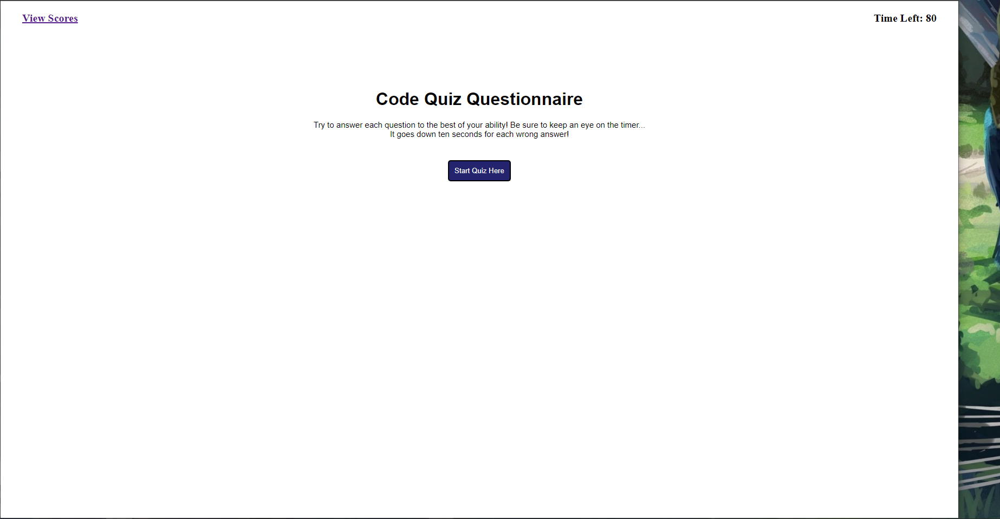

# Code Quiz

I know I barely have any of the actual functionaity in place... but i feel that if I at least turn in what I have for now I could get some desperately needed help. So far when it comes to the logic of targeting specific elements with event listeners I just have the hardest time figuring out where to take the next step. Any sort of advice would be GREATLY appreciated. I'm sorry for the inconvinience.

## here is a screenshot of the website

## Here are some links pertaining to the assigment

* Github: https://github.com/Servbt/Coding-Quiz
* Web-page: https://servbt.github.io/Coding-Quiz/
